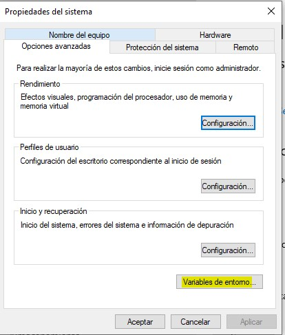
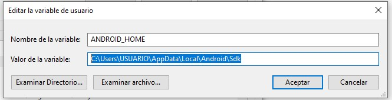
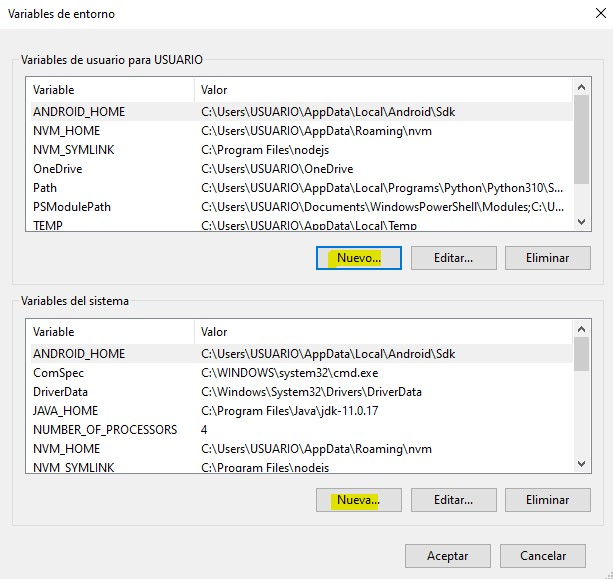
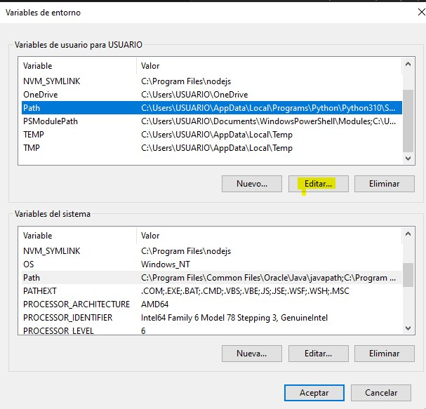
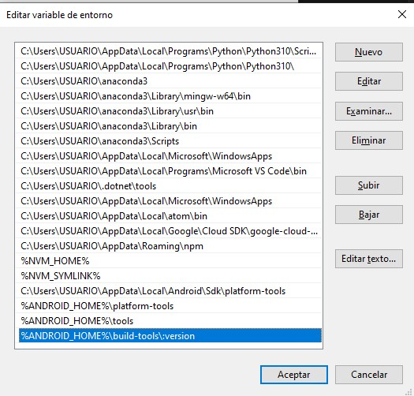

# How to run Kraken tests

## On Mac OS

### Prerequisites

- Node v16.20.2
- npm v8.19.4
- Ghost 5.68.0
- Android Studio: On the properties of android studio you must have installed:
  - Android SDK Platform-Tools
  - Android SDK Build-Tools
  - Android SDK Tools (Obsolete) (If you're using a Giraffe version or superior)
- Java 21

### Steps

1. Go to the root of the Kraken project

```
cd Kraken_Tests_E2E
```

2. Install dependencies

- Install kraken-node globally

```
npm install kraken-node -g
```

- Install kraken-node locally

```
npm install kraken-node
```

- Install appium locally

```
npm install appium
```

- Install chai

```
npm install chai
```

- Set up the environment variables

```
export ANDROID_HOME="${HOME}/Library/Android/sdk"
export PATH="${HOME}/Library/Android/sdk/tools:${HOME}/Library/Android/sdk/platform-tools:${HOME}/Library/Android/sdk/build-tools/34.0.0/aapt:$PATH"
export PATH="$PATH:$ANDROID_HOME/tools:$ANDROID_HOME/platform-tools:$ANDROID_HOME/build-tools/34.0.0"
export JAVA_HOME="/Library/Java/JavaVirtualMachines/jdk-21.jdk/Contents/Home"
export NVM_DIR="$HOME/.nvm"
  [ -s "/usr/local/opt/nvm/nvm.sh" ] && \. "/usr/local/opt/nvm/nvm.sh"  # This loads nvm
  [ -s "/usr/local/opt/nvm/etc/bash_completion.d/nvm" ] && \. "/usr/local/opt/nvm/etc/bash_completion.d/nvm"
```

- Rename the `properties.json.example` file in the root of the Kraken_Tests_E2E folder to `properties.json` and set the url of the ghost site, the email and the password of the admin user that will be used to run the tests.

the file should look like this:

```
{
  "USERNAME1": "test@test.com",
  "PASSWORD1": "12345678910",
  "GHOST_URL": "http://localhost:2368/ghost"
}

- Run kraken tests

```
npx kraken-node run


## On Windows OS

### Prerequisites

- Node v12.22.12
- npm v6.14.16
- Ghost 5.68.0
- Android Studio: On the properties of android studio you must have installed:
  - Android SDK Platform-Tools
  - Android SDK Build-Tools
  - Android SDK Tools (Obsolete) (If you're using a Giraffe version or superior)
- Java 17

### Steps

1. Go to the root of the Kraken project

```
cd Kraken_Tests_E2E
```

2. Before install the dependencies, execute the command 

```
npm init
```

- Install kraken-node globally

```
npm install kraken-node -g
```

- Install kraken-node locally

```
npm install kraken-node
```

- Install appium locally

```
npm install appium
```

- Install chai

```
npm install chai
```


- Set up the environment variables

Open the Properties of the System and select the option "Variables de Entorno":



After that, create a new variable for the User and the System called ANDROID_HOME with the value C:\Users\USUARIO\AppData\Local\Android\Sdk:



The result should be like this:



Then, edit the variable path:



And add the following values:

- %ANDROID_HOME%\platform-tools
- %ANDROID_HOME%\tools
- %ANDROID_HOME%\build-tools\:version

The result should be like this:



Apply the changes. In the same way don't forget to declare the JAVA_HOME variable for your Java version. You can use the following url like a guide for this task:

[url](https://www.theserverside.com/feature/How-to-set-JAVA_HOME-in-Windows-and-echo-the-result) 

- Rename the `properties.json.example` file in the root of the Kraken_Tests_E2E folder to `properties.json` and set the url of the ghost site, the email and the password of the admin user that will be used to run the tests.

the file should look like this:

```
{
  "USERNAME1": "test@test.com",
  "PASSWORD1": "12345678910",
  "GHOST_URL": "http://localhost:2368/ghost"
}

- Run kraken tests. For this, open the console of Git Bash in the folder Kraken_Tests_E2E and execute the command:

```
./node_modules/kraken-node/bin/kraken-node run
```
