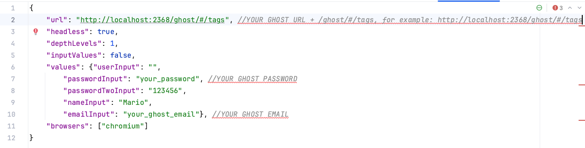
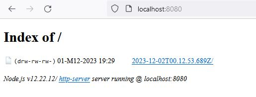
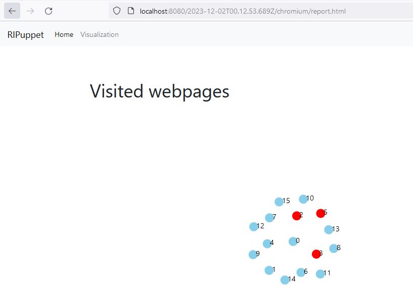

# RIPuppet
A node js library for GUI Ripping on web applications

# Executing

First check that you are using a valid Node version. We recommend you to use Node v12.22.12.

After that, you should go to the folder RIPuppetPages and install the packages with the command:

```
npm install

```

Check the content inside config.json file. 
And modify the parameters according to your needs.



Modify the required parameters.

To execute the testing tool use the following command:

```
node index.js

```

Once you see the folder results, open a new terminal and inside this folder execute the following command in order to generate the report:

```
npm install -g http-server

```

For seeing the report, execute the following command:

```
http-server

```

Open the url indicated by the terminal (in general it is localhost:8080 ) and select the folder with the last date:



 Open it and select Chronium. Finally, click in the report.html. you should see the report with a graph:

