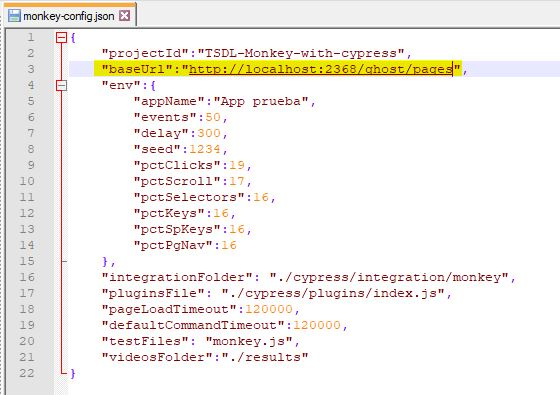
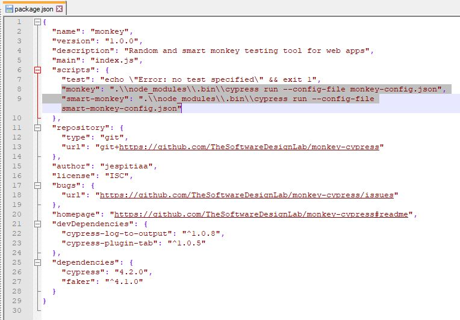

# Cypress Random Tester (Monkey)
This repository contains the code for a random tester developed using [Cypress](https://www.cypress.io/). Two versions are developed, including a full random tester and a smarter random tester, and the differences between these two remain in the type of commands that each can execute. The detail is explained in sections below

## Environment
Create file cypress.env.json and use cypress.env.json.example as a base

- ghost_email: Email for the ghost admin
- ghost_password: password for the ghost admin

Update the url to visit in the files monkey_config.json and smart_monkey_config.json in the parameter baseUrl as you can see in the picture (also you can change the seed. For the results of this tests the seed used was 7655):



If you are working with Windows, update the paths in the package.json with the paths:



## How to run
In order to use the tester, you will have to follow these steps:
- Get the source code from this repository: Click on Download as Zip and unzip the folder in your machine or clone the repo
- Install the required modules: Using [Node Package Manager](https://www.npmjs.com/), run `npm install` on the root folder; this will install the cypress CLI module and other dependencies, which are the [faker](https://www.npmjs.com/package/faker) module and a cypress [plugin](https://github.com/Bkucera/cypress-plugin-tab) for pressing the tab key, along with [another plugin](https://github.com/flotwig/cypress-log-to-output) for capturing the browser console output. In case you already have cypress installed, it is better to avoid installing it again in this folder; for this, run the commands `npm install faker`, `npm install -D cypress-log-to-output` and `npm install -D cypress-plugin-tab` individually.
- Configure the desired parameters: The repository's root folder contains two JSON files which have the configuration parameters for each test. Open them and edit the parameters as needed. You can change the baseURL, the seed for the test, the percentage of events, the delay between events, and the number of events.
- Run the desired tester: The commands for running the tests must be executed from the root folder, so do not forget to change de directory again with the `cd` command. For the random tester, run `cypress run --config-file ./monkey-config.json`. For the slightly smarter random tester, run `cypress run --config-file ./smart-monkey-config.json`. 

\* Note: The default browser is Electron 78 in headless mode. In order to test another browser, add the `--browser <browser-name-or-path>` option to the run command, indicating which of the [supported browsers](https://docs.cypress.io/guides/guides/launching-browsers.html#Browsers) you want to use

\* Note2: If you work with Windows, open the terminal and in the path node_modules\\.bin of the folder, execute the command:

```
npm run smart-monkey

```

## The testers
Cypress is an E2E test runner built over JavaScript. We used this technology due to the facility for managing web pages in a variety of browsers including Chrome, Canary, Edge, Electron, etc. and the record-and-replay functionality. The idea of the first tester is to perform a completely random test on a web application, inspired on a similar tester, the [Android Monkey](https://developer.android.com/studio/test/monkey). The second tester exists due to the high rate of errors and low probability of getting events that change the application's state of the Monkey tester.

## Events
After evaluating a series of possible events, we defined the following 8 categories in which the events could be grouped by:
- **Random Click Events**:
Left, Right or Double clicks performed to an element from a random position
- **Scroll Events**:
Scrolling the page up, down, to the left or to the right.
- **Selector Focus Events**:
Focusing on elements from a random position, considering their HTML tags. The equivalent for pressing tab into a focusable element
- **Keypress Events**:
Introducing a character inside of a focused element. The equivalent for pressing a key from the keyboard when focusing an element.
- **Special Keypress Events**:
Typing special characters inside of a focused element. The special keys include Enter, Supr, Esc, Backspace, Arrows, and possible modifiers such as Shift, Alt or Ctrl.
- **Page Navigation Events**:
Typical navigation that an user could perform, go to the last page or to the next page in the navigation Stack.
- **Browser Chaotic Events**:
Events that change the browser configuration such as changing the viewport, clearing local storage or clearing the cookies.
- **Selector Click Events**:
Clicks performed to a specific type of element considering the HTML tags that typically induce an interaction such as `<a>`, `<button>`, `<input type="submit">`; also, events of filling and clearing an input element.

## Results
When the test finishes running, an HTML report and a video of the execution in a browser will be generated in the results folder.

